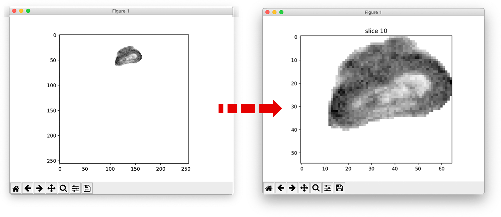

# trim_image_roi
## Trim a 3D volume based on its Volume Of Interest.  
The image and the VOI file are `.nii` files.
  
After giving the two paths (image and VOI) it will load them, removes the areas we don't care about (using the ROI) then performs the trim. 
Here an example:

The final size is the best fitting crop of the 3D image.

## License
Before use it we invite you to read the LICENSE. 

This file is distributed under the terms of the __GNU General Public License v3.0__ 
Permissions of this strong copyleft license are conditioned on making available complete source code of licensed works and modifications, which include larger works using a licensed work, under the same license. __Copyright and license notices must be preserved__. Contributors provide an express grant of patent rights. 

Visit <http://www.gnu.org/licenses/> for further information. 